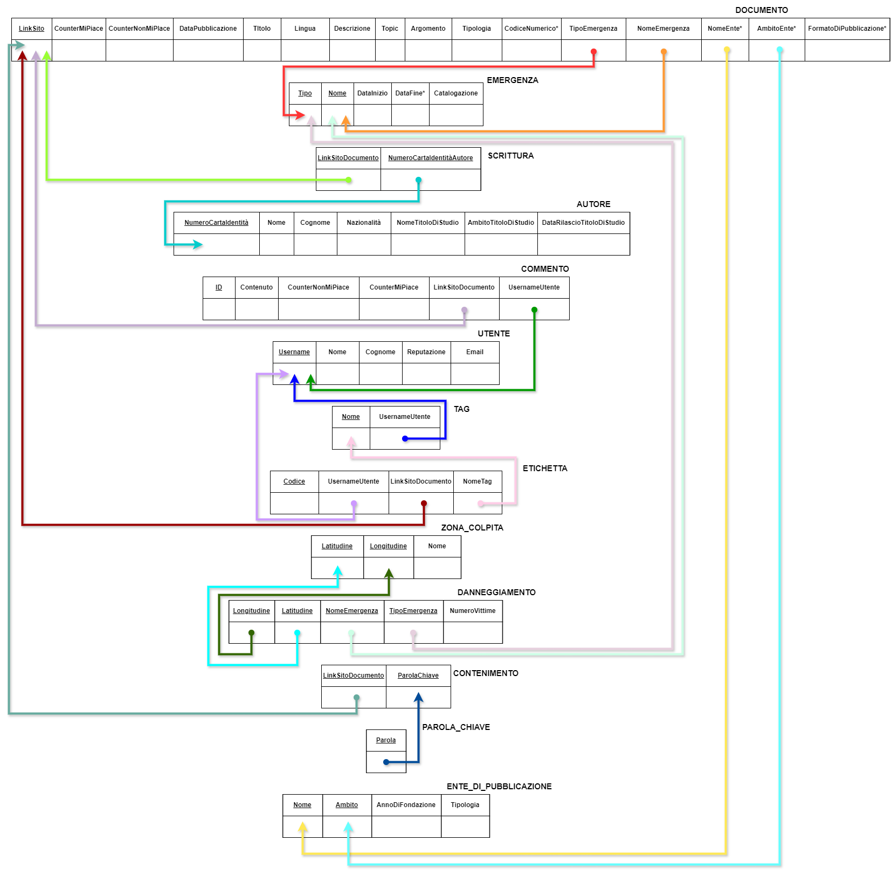

# BDEmergency - Database per Emergenze Nazionali 

Progetto universitario per il corso di **Basi di Dati** (2023/2024), Ingegneria Informatica, Università degli Studi di Salerno.

## Descrizione
Il progetto **BDEmergency** è un database progettato per gestire e storicizzare la documentazione relativa alle emergenze nazionali ed europee (terremoti, pandemie, incidenti, etc...). Il sistema permette di catalogare documenti (articoli, decreti, pubblicazioni scientifiche), tracciare gli autori, gestire le zone colpite e monitorare l'interazione degli utenti tramite commenti e tag.

##  Tecnologie Utilizzate
* **DBMS:** PostgreSQL
* **Linguaggio:** SQL, PL/pgSQL
* **Strumenti:** Draw.io (per la modellazione)

##  Caratteristiche Principali
Il database implementa diversi pattern avanzati e vincoli di integrità complessi:
* **Design Patterns:**
    * Storicizzazione: gestione di emergenze correnti e passate.
    * Reificazione: gestione delle relazioni ternarie (e.g. Etichetta) e degli attributi multivalore.
* **Trigger e Funzioni (PL/pgSQL):**
    * Calcolo automatico della reputazione utente basata sui feedback.
    * Controllo dei permessi per la creazione di tag (basato sulla reputazione).
    * Vincoli di cardinalità complessi (e.g. `AtLeastOneOnDanneggiamento`).
* **Viste:** Analisi attività utente e panoramica delle emergenze.

##  Struttura del Database
### Schema Concettuale (E-R)

### Schema Logico Relazionale

## Come Eseguire il Progetto
Per testare il database in locale:
1. Clonare la repository.
2. Creare un database vuoto su PostgreSQL.
3. Eseguire gli script nella cartella `sql/` nel seguente ordine:
    1. `01_creazione.sql`: crea domini, tabelle e vincoli base.
    2. `02_trigger.sql`: installa le funzioni PL/pgSQL e i trigger.
    3. `03_popolamento.sql`: inserisce i dati di test (Utenti, Emergenze, Documenti).
    4. `04_query_viste.sql`: esegue interrogazioni di prova e crea le viste.

## Autori
* **Lorenzo Iantosca** 
* **Angelo Infante** (InfanteAngelo su GitHub)

